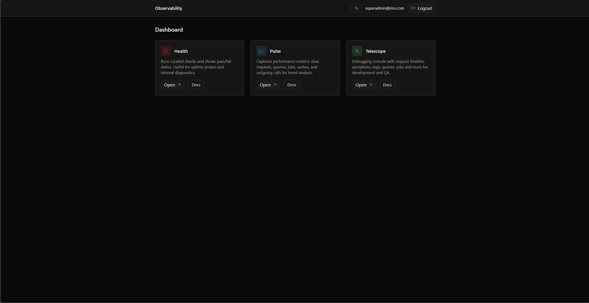
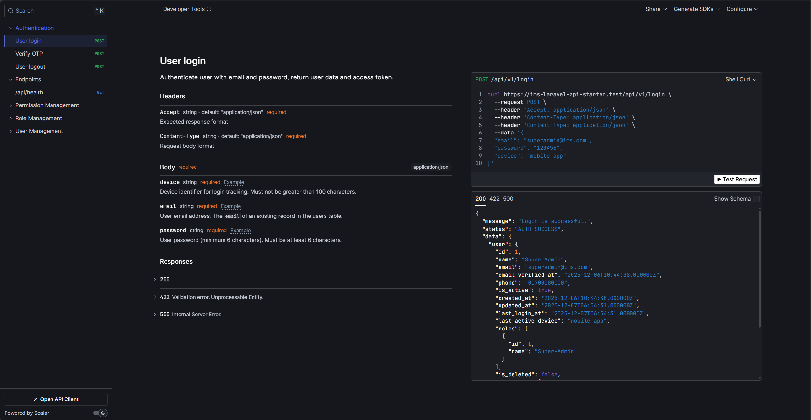

# IMS Laravel API Starter

A production-ready Laravel API starter kit with enterprise-grade features. Built-in authentication, RBAC, comprehensive API documentation, and advanced observability tools. Designed for rapid development with clean architecture patterns.

<p align="center">
  
  <br>
  <em>Observability Dashboard</em>
</p>

<p align="center">
  
  <br>
  <em>Scalar API Documentation</em>
</p>

## Features

- 🔐 **Laravel Sanctum** - Secure API authentication with personal access tokens
- 🔑 **RBAC System** - Role-based access control with permissions and roles
- 📚 **API Documentation** - Scalar, Swagger UI, OpenAPI with Postman compatibility
- 📊 **Observability** - Telescope, Pulse, Health with unified dashboard
- 🛠️ **Clean Architecture** - Repository pattern, DTOs, service layer
- 💾 **Data Management** - User management, data export, media library, backups
- 🌍 **Internationalization** - Multi-language support (Bangla & English)
- 🐳 **Docker Support** - Complete containerized development environment
- ⚡ **Development Tools** - Code generators, IDE helpers, Git hooks

## Quick Start

### Prerequisites
- PHP 8.2+
- MySQL 8.0+
- Node.js 16+
- Composer

### Development Setup

1. **Clone and setup**
   ```bash
   git clone git@github.com:Innovix-Matrix-Systems/ims-laravel-api-starter.git
   cd ims-laravel-api-starter
   cp .env.example .env
   ```

2. **Install dependencies**
   ```bash
   composer install
   npm install
   npx husky install
   ```

3. **Database setup**
   ```bash
   php artisan migrate --seed
   ```

4. **Start development**
   ```bash
   php artisan serve
   ```

### Default Credentials
- **Super Admin**: superadmin@ims.com / 123456

## 📖 Documentation

### 🌐 [GitHub Wiki](https://github.com/Innovix-Matrix-Systems/ims-laravel-api-starter/wiki)

Comprehensive documentation covering:
- **Features Overview** - Complete feature breakdown
- **Quick Start Guide** - Step-by-step setup instructions
- **API Documentation** - Interactive API docs and testing
- **Observability Guide** - Monitoring and debugging tools
- **Project Structure** - Directory organization and architecture
- **Running Tests** - Testing guidelines and commands
- **Backup System** - Application and database backup
- **Docker Guide** - Container development setup
- **Extra Information** - Additional development tools

### API Documentation

- **Scalar UI**: http://localhost:8000/docs
- **Swagger UI**: http://localhost:8000/docs/swagger
- **OpenAPI Spec**: http://localhost:8000/docs/openapi.yaml

### Observability

- **Dashboard**: http://localhost:8000/observability
- **Health Check**: http://localhost:8000/health

> **Note**: Observability tools require authentication

## Commands

```bash
# Code generation
php artisan make:crud Product
php artisan make:dto ProductDTO
php artisan make:service Product/ProductService

# Code quality
php artisan pint
php artisan optimize:clear
```

## License

This project is licensed under the `MIT License` - see the [LICENSE.md](LICENSE.md) file for details.